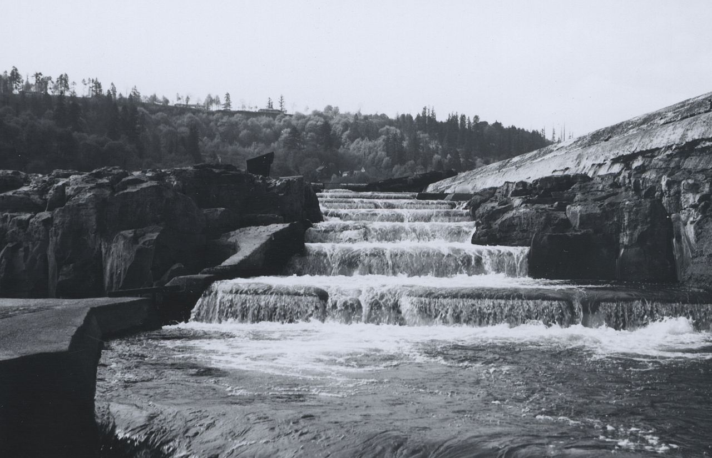
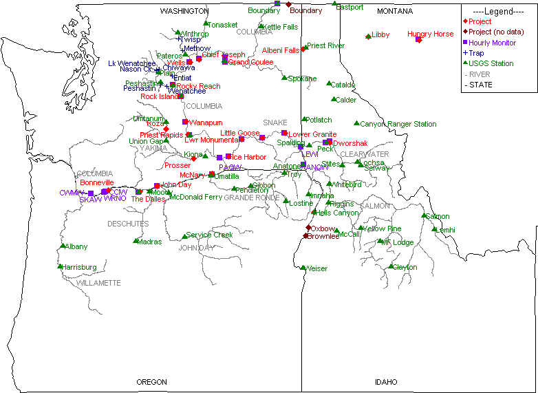

# Introduction

The Willamette River Fish Ladder was constructed in 1971 by the Oregon Department of Fish and Wildlife. The fish ladder helps fish migrate over the Willamette Falls and is used to count the number of fish that pass through the river. The fish are counted through a viewing window using time lapsed video footage.

*Source: Willamette River. (2012). Portlandgeneral.com. https://portlandgeneral.com/about/rec-fish/willamette-river*



*Image Source: Fish ladder on Willamette River.jpg - Wikimedia Commons. 2020. https://commons.wikimedia.org/wiki/File:Fish_ladder_on_Willamette_River.jpg.*

In the following code, I analyzed this fish passage data between the years 2001 and 2010 to identify any seasonal or cyclical patterns and trends in fish passage over time for three species of fish: steelhead, coho, and jack coho. I first created a time series visualization of the data for each species to see the overall trends in fish passage for all 10 years. I then created season plots for each to identify the trends in fish passage on a yearly basis. I then created plots of total annual fish passage to see how total fish passage has changed over time. The map below shows the location of the Willamette River in Oregon.   



*Image Source: DART Map of Columbia Basin Data Collection Locations | Columbia Basin Research. 2022. http://www.cbr.washington.edu/dart/dartmap/.*

```{r setup, include=TRUE, warning = FALSE, message = FALSE}
knitr::opts_chunk$set(echo = TRUE, warning = FALSE, message = FALSE)

library(here)
library(tidyverse)
library(lubridate)
library(tsibble)
library(feasts)
library(slider)
library(plotly)
library(patchwork)
library(paletteer)

# read in the data and replace NAs with 0s
fish <- read_csv(here("willamette_fish_passage.csv")) %>%
  mutate_all(~replace_na(.,0)) %>% 
  janitor::clean_names() 
  # pivot_longer(cols = chinook_run:pink, names_to = "species") %>%
  # filter(species %in% c("coho","jack_coho","steelhead")) 

fish_ts <- fish %>%
  mutate(date = lubridate::mdy(date)) %>% 
  as_tsibble(key = NULL, index = date)
  # group_by(species)


```

# Time Series Visualizations {.tabset}

## Original Time Series

The following figure contains time series plots for daily fish passage through the Willamette River Fish Ladder for three fish species: steelhead, coho, and jack coho.

```{r}
steelhead_time <- ggplot(data = fish_ts, aes(x = date, y = steelhead)) +
                             geom_line(color = "#80aaaa", alpha = 0.8) +
                             labs(x = " ", y = "Steelhead") +
                             theme_minimal() +
  theme(axis.title.x=element_blank(),
        axis.text.x=element_blank())

coho_time <- ggplot(data = fish_ts, aes(x = date, y = coho)) +
                             geom_line(color = "#c15db2", alpha = 0.8) +
                             labs(x = " ", y = "Coho") +
                             theme_minimal() +
  theme(axis.title.x=element_blank(),
        axis.text.x=element_blank())

jack_coho_time <- ggplot(data = fish_ts, aes(x = date, y = jack_coho)) +
                             geom_line(color = "#ff9900", alpha = 0.8) +
                             labs(x = "Date", y = "Jack Coho") +
                             theme_minimal()
  # scale_x_continuous(breaks = c(2001,2002,2003,2004,2005,2006,2007,2008,2009,2010))

steelhead_time/coho_time/jack_coho_time

# ggplotly(ggplot(data = fish_ts, aes(x = date)) +
#   geom_line(aes(y = steelhead), color = "#80aaaa", alpha = 0.8, ) + #blue
#   geom_line(aes(y = coho), color = "#c15db2", alpha = 0.8) + #pink
#   geom_line(aes(y = jack_coho), color = "#ff9900", alpha = 0.8) + #orange
#   theme_minimal() +
#   labs(x = "Date", y = "Number of fish per day"))

```

**Figure 1:** Time series of number of fish passing through the Willamette River Fish Ladder per day over time. The color indicates the species of fish, with blue indicating steelhead, pink indicating coho, and orange indicating jack coho. 

- Steelhead and jack coho species do not seem to show any obvious trends, while coho seem to have an overall increasing trend from 2001 to 2010.
- All three species seem to exhibit seasonality in that each one has a spike in fish passage at a specific time every year.
- Coho and jack coho may exhibit cyclical patterns, as they each have a significantly larger spike every couple of years.

## Season Plots

The following figure contains season plots for daily fish passage through the Willamette River Fish Ladder for three fish species: steelhead, coho, and jack coho.

```{r}
# monthly seasonplot
fish_month <- fish_ts %>%
  index_by(yr_mo = ~yearmonth(.)) %>%
  summarize(monthly_mean_steelhead = mean(steelhead, na.rm = TRUE),
            monthly_mean_coho = mean(coho, na.rm = TRUE),
            monthly_mean_jack_coho = mean(jack_coho, na.rm = TRUE))

steelhead_season <- fish_month %>%
  gg_season(y = monthly_mean_steelhead, 
            pal = paletteer_c(palette = "ggthemes::Blue", n = 10)) +
  labs(x = " ", y = "Steelhead") +
  theme_minimal() +
  theme(legend.position = "none") +
  theme(axis.title.x=element_blank(),
        axis.text.x=element_blank()) 

coho_season <- fish_month %>%
  gg_season(y = monthly_mean_coho, 
            pal = paletteer_c(palette = "ggthemes::Purple", n = 10)) +
  labs(x = " ", y = "Coho") +
  theme_minimal() +
  theme(legend.position = "none") +
  theme(axis.title.x=element_blank(),
        axis.text.x=element_blank())

jack_coho_season <- fish_month %>%
  gg_season(y = monthly_mean_jack_coho, 
            pal = paletteer_c(palette = "ggthemes::Orange", n = 10)) +
  labs(x = "Month", y = "Jack Coho") +
  theme_minimal() +
  theme(legend.position = "bottom")

steelhead_season/coho_season/jack_coho_season

```

**Figure 2:** Season plots for steelhead, coho, and jack coho fish. The figures show the average number of each species of fish passing through the Willamette River Fish Ladder per month for each year of data collected. 

- Steelhead seem to pass through the ladder primarily from January to July, while coho and jack coho seem to pass through the ladder primarily from August to November.
- Steelhead passage seems to have decreased slightly in later years, while coho and jack coho passage seems to have increased slightly in later years. 

## Annual Total Fish Passage

The following figure contains plots showing annual total fish passage through the Willamette River Fish Ladder for three fish species: steelhead, coho, and jack coho.

```{r}
fish_year <- fish_ts %>%
  index_by(yearly = ~year(.)) %>%
  summarize(annual_sum_steelhead = sum(steelhead, na.rm = TRUE),
            annual_sum_coho = sum(coho, na.rm = TRUE),
            annual_sum_jack_coho = sum(jack_coho, na.rm = TRUE))

steelhead_year <- ggplot(data = fish_year, aes(x = yearly, y = annual_sum_steelhead)) +
  geom_col(fill = "#80aaaa") +
  labs(x = " ", y = "Steelhead") +
  theme_minimal() +
  theme(legend.position = "none") +
  theme(axis.title.x=element_blank(),
        axis.text.x=element_blank())

coho_year <- ggplot(data = fish_year, aes(x = yearly, y = annual_sum_coho)) +
  geom_col(fill = "#c15db2") +
  labs(x = " ", y = "Coho") +
  theme_minimal() +
  theme(legend.position = "none") +
  theme(axis.title.x=element_blank(),
        axis.text.x=element_blank())
  # scale_color_gradient(low = "#d4ebf2", high = "#4e8ca5")

jack_coho_year <- ggplot(data = fish_year, aes(x = yearly, y = annual_sum_jack_coho)) +
  geom_col(fill = "#ff9900") +
  labs(x = "Year", y = "Jack Coho") +
  theme_minimal() +
  theme(legend.position = "bottom") +
  scale_x_continuous(breaks = c(2001,2002,2003,2004,2005,2006,2007,2008,2009,2010))

steelhead_year/coho_year/jack_coho_year
```

**Figure 3:** Annnual total fish passage through the Willamette River Fish Ladder by species. 

- Total annual steelhead passage through the ladder has decreased on average over time, while total annual coho passage has increased on average over time. 
- Total annual jack coho passage seems to have increased on average over time, but has experienced stronger fluctuations than the other two species. Jack coho passage spiked in 2002-2003 and in 2008-2010. 

# Conclusion

Analysis of time series plots, season plots, and total annual passage plots for steelhead, coho, and jack coho fish species reveal important findings about these species. Steelhead fish seem to be decreasing in abundance over time, while coho fish seem to be increasing in abundance over time. Jack coho fish abundance is harder to estimate as this population experiences stronger fluctuations over time. Steelhead fish seem to travel the Willamette River earlier in the year, while coho and jack coho fish seem to travel it later in the year. Overall, data from the Willamette River Fish Ladder can give us valuable insight into the abundance and migratory patterns for various fish species. 


**Data Source:** DART Adult Passage Graphics & Text | Columbia Basin Research. 2022. http://www.cbr.washington.edu/dart/query/adult_graph_text.

