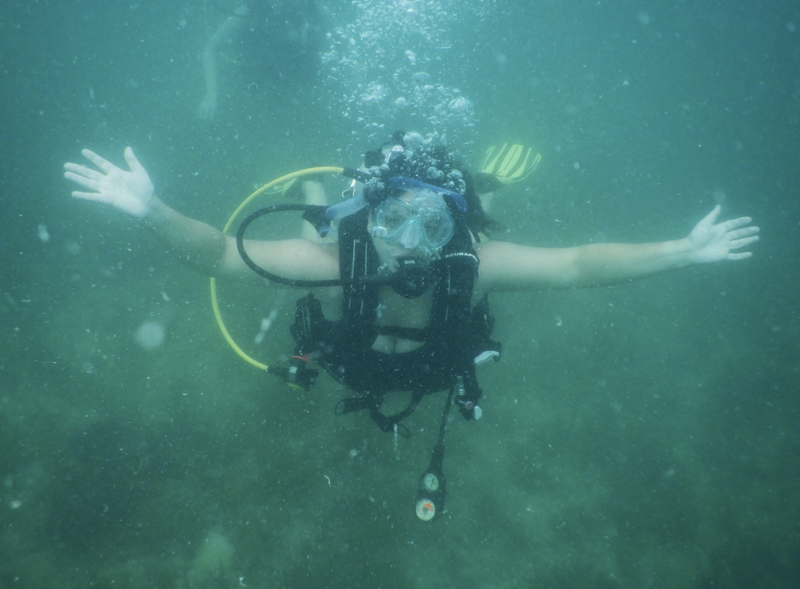
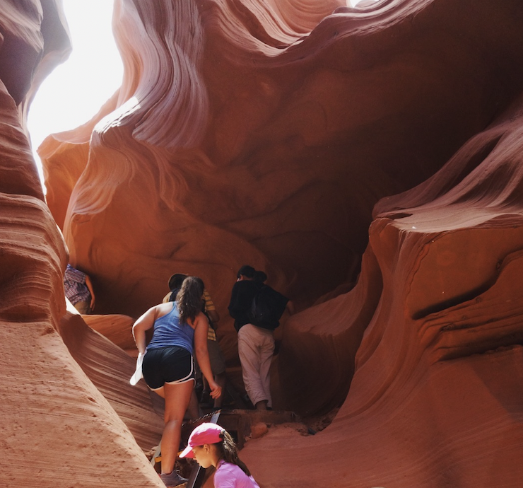

```{r setup, include=FALSE}
knitr::opts_chunk$set(echo = FALSE)
```

## Interests

I am currently pursuing a career in the area of corporate sustainability. I hope to help companies in their transitions to greater use of renewable energy, more sustainable supply chains, and overall reductions in their environmental impacts while fostering their long term success. 

<a href = 'hamilton_resume.pdf' target = '_blank'>Link to my resume</a>

## Education

**UCSB Bren School of Environmental Science and Management** | Santa Barbara, CA

Master of Environmental Science and Management | September 2021 - June 2023

**Carnegie Mellon University** | Pittsburgh, PA

B.S. in Civil Engineering, Additional Major in Engineering and Public Policy | August 2017 - May 2021


## Experience

**Food Systems Policy Research Assistant** | Carnegie Mellon University, Pittsburgh, PA | August 2020 - May 2021

•	Developed recommendations for food policy by analyzing the effectiveness and uncertainty of three proposed policies pertaining to the environmental sustainability and equity of the Pittsburgh food system

•	Authored an academic paper with policy recommendations to reduce food waste and meat consumption to lower carbon emissions by up to 50%  

**Civil Engineering Research Assistant** | Carnegie Mellon University, Pittsburgh, PA | May 2019 - December 2019

•	Developed a hand washing monitoring system through data analysis; collected vibration data from 4 sink locations and analyzed the data in MATLAB using feature selection and support vector machines

•	Co-authored an academic paper that will be published in ACM Transactions on Computing for Healthcare 

**Engineering, Scientific, and Technical Intern** | Pennsylvania Department of Transportation, Pittsburgh, PA | May 2018 - August 2018

•	Utilized roadway design plans and construction standards to ensure accurate implementation and environmental compliance of various types of drainage adjustments and paving operations

•	Assisted construction inspectors with calculations for bridge and roadway construction projects to ensure PennDOT construction specification were met and to ensure engineering integrity  


## Engineering Projects

**Electric Vehicle (EV) Adoption Impacts** | Engineering and Public Policy Senior Projects II | February 2021 - May 2021

•	Analyzed the effects of increased EV adoption by using Excel to model what percent of EV adoption would threaten local electric grid reliability due to decreased prospective reserve margins

•	Formed recommendations for policy makers to support an equitable transition to electric vehicles

**Aquaponics Greenhouse** | Civil and Environmental Engineering Senior Design | August 2020 - December 2020

•	Designed and built a mock-up aquaponics system with a nine-person team for a Pittsburgh community 

•	Consulted with stakeholders at the Center of Life and at Hatponics Sustainable Agriculture to ensure that the complex technical components of the system met the center’s educational and environmental goals


## Photos




